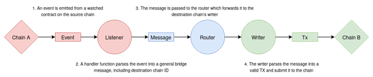

# Chain Bridge Protocol

The bridge allows two economically independent and technologically different chains to communicate with each other. They can range from centralized and reliable to decentralized and with minimal trust. One of the currently available solutions is ChainBridge, a modular multi-directional blockchain bridge built by ChainSafe. The ChainBridge implementation is now available in Canopus, which connects the Avalanche C-Chain and BSC.

This guide is divided into two main sections. In the first part, we will explain the general bridge workflow. In the second part, we will look at some examples of using a bridge to transfer ARC-20 and BEP-20 resources between Avalanche C-Chain and BSC Networks.

How does the bridge works ChainBridge is essentially a messaging protocol. Events in the source chain are used to send a message that is routed to the destination chain. There are three main roles: 


• Listener: retrieves events from the original chain and creates a message 

• Router: transfers a message from a listener to a writer. 

• Writer: interpret messages and send transactions to the destination chain 


ChainBridge currently relies on trusted relays to fulfill these roles. However, it has a mechanism that prevents abuse of power and misuse of funds by any single repeater. At a high level, repeaters create proposals in the target chain that are sent to other repeaters for approval. An approve vote also happens on the target chain, and each proposal is only executed after it reaches a certain voting threshold.


On both sides of the bridge, there is a set of smart contracts, each of which performs a specific function:


> #### • **Bridged Contract - Users and repeaters interact with this contract. It delegates calls to the handler contracts for deposits, starts a transaction on the source chain, and to execute proposals on the target chain.**

> #### **• Handler Contracts - validates the options provided by the user, creating a deposit / execution** record

> #### **• Target Contract - As the name suggests, this is the contract we are going to interact with on each side of the bridge. General workflow The general workflow is as follows \(from chain A to chain B\):**


• The user initiates a transaction using the deposit \(\) function in the bridge contract of chain A. Here the user needs to enter the target chain, resource ID and calldata \(definitions after the diagram\). After several checks, the deposit \(\) function of the handler contract is called, which makes the appropriate call to the target contract. 

• After the function of the target contract on chain A has been executed, a deposit event is generated by the bridge contract, which contains the necessary data to execute on chain B. This is called an offer. Each offer can have five statuses \(inactive, active, passed, completed and canceled\). 

• Relays always listen on both sides of the circuit. As soon as the relay intercepts the event, it initiates a vote on the proposal, which occurs in the bridge contract in chain B. This sets the proposal state from inactive to active. 

• Repeaters must vote on the proposal. Each time a repeater votes, the bridge contract generates an event that updates its status. After reaching the threshold, the status changes from active to passed. The repeater then executes the offer on chain B through the bridge contract. 

• After several checks, the bridge executes the offer in the target contract through the handler contract in chain B. Another event is raised that updates the offer status from submitted to completed. This workflow is illustrated in the following diagram:


### This workflow is illustrated in the following diagram:

> The two target contracts on each side of the bridge are linked by performing a series of registrations in the corresponding processor contract through the bridge contract. These registrations can currently only be performed by the bridge contract administrator.

### General definitions

Here we have compiled a list of concepts applicable to the ChainBridge implementation \(from Chain A to Chain B\)

* **ChainBridge** _Chain ID - Not to be confused with the ChainBridge ID. This is a unique network identifier used by the protocol for each chain. It may differ from the actual chain ID of the network itself._ 
* **Resource ID** _is a 32-byte word designed to uniquely identify an asset in a cross-chain environment. Note that the low byte is reserved for the chainId, so we have 31 bytes in total to represent the chain asset in our bridge. For example, it could be the expression tokenX on chain A is equivalent to tokenY on chain B_ 
* **Calldata** i_s a parameter required by the handler that includes the information needed to execute the statement on chain B. The exact serialization is defined for each handler. You can find more information_ [_**here**_](https://chainbridge.chainsafe.io/chains/ethereum/#erc20-erc721-handlers)_\*\*\*\*_

\_\_

