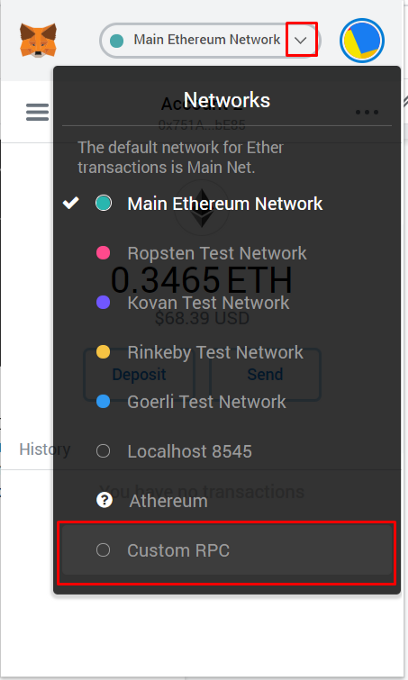

# How To Set Up A Wallet

## Step 1: Setting up MetaMask


Always make sure that you're downloading your wallets from the real source. Psyching websites are known to pay for Google ads and use other malicious ways to persuade you into downloading a fake wallet. 

The only URL of MetaMask is [https://metamask.io/](https://metamask.io/).



Unfortunately as of now MetaMask does not offer native integration for Avalanche Smart Chain, so we will have to take a way that's a tiny bit technical, but don't worry, it just looks hard, it's actually simple.


**Log in to MetaMask -&gt; Click the Network drop-down -&gt; Select Custom RPC**



#### **Avalanche Mainnet Settings:**

* **Network Name**: Avalanche Mainnet C-Chain
* **New RPC URL**: [https://api.avax.network/ext/bc/C/rpc](https://api.avax.network/ext/bc/C/rpc)
* **ChainID**: `43114`
* **Symbol**: `AVAX`
* **Explorer**: [https://cchain.explorer.avax.network/](https://cchain.explorer.avax.network/)

## Step 2: Canopus Wallet Setup

After adding Avalanche C-Chain to Metamask network you need to go add token section and choose the Custom Token


## $OPUS Contract Address

```text
0x76076880e1EBBcE597e6E15c47386cd34de4930F
```

> Copy the contact address and paste it to the section: Token Contract Address.


Sometimes your tokens might not appear in your wallet, that's because MetaMask did not detect them automatically. If that happens to you, just click on "Add Token" -&gt; "Custom Token" and from here input the smart contract address of the token in the "Token Contract Address" tab. MetaMask should automatically pick the symbol and decimals. After that click "Next" -&gt; "Add Tokens" and you're done!


## Additional information about Canopus Network

For additional information feel free to refer to our [White Paper](https://github.com/Canopus-Network-OPUS/OPUS/blob/main/Canopus%20Whitepaper.pdf).


If you still have any questions or issues, feel free to reach the Canopus team in the [telegram group](https://t.me/canopus_network).


