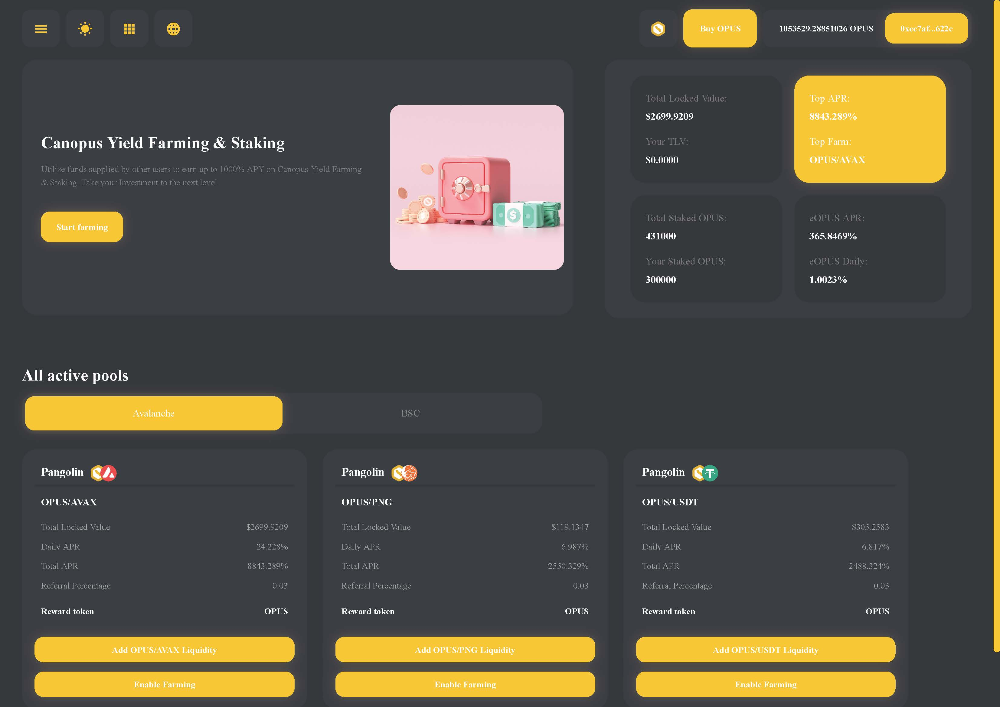

# Yield Farming

## **What is Liquidity Staking?**

Liquidity Staking is the process of staking the liquidity you add to the Canopus Pangolin & Pancakeswap pools and earning OPUS rewards in return.

For an LP provider, you are now doubly interested in keeping your LP token, because you not only receive trading fees but also receive a reward in the form of OPUS tokens.

The Canopus project benefits from liquidity staking because it means our community helps us by adding liquidity to our Pangolin & Pancakeswap pools and then placing that liquidity during the staking period. This helps maintain liquidity and reduce slippage, which in turn can increase trading activity. 

## How to join LP Pool

### 1. How to obtain tokens on Avalanche or Binance Smart Chain Networks


#### **Canopus \(OPUS\) Contract Address on Avalanche & Binance Smart Chains**  _`0x76076880e1EBBcE597e6E15c47386cd34de4930F`_


* Buy OPUS tokens on [Pangolin](https://app.pangolin.exchange/#/swap?inputCurrency=0x76076880e1ebbce597e6e15c47386cd34de4930f), [Pancakeswap ](https://pancakeswap.finance/swap?inputCurrency=0x76076880e1ebbce597e6e15c47386cd34de4930f&outputCurrency=0xe9e7cea3dedca5984780bafc599bd69add087d56)or [DODOEX](https://app.dodoex.io/exchange/BUSD-OPUS?network=bsc-mainnet)
* Buy AVAX, PNG, USDT.e tokens on [Pangolin](https://app.pangolin.exchange/#/swap?inputCurrency=0x76076880e1ebbce597e6e15c47386cd34de4930f) or buy BNB, BUSD on [Pancakeswap](https://pancakeswap.finance/swap) or [DODOEX](https://app.dodoex.io/exchange?network=bsc-mainnet)

### 2.  A**dd liquidity to the Pool** 

* Open [Canopus Yield Farming & Staking App](https://app.canopus.network)
* Select the network you want to stake \(**Avalanche C-Chain** & **Binance Smart Chain\)**
* Select the pairs
  * **Avalanche Network**
    * [OPUS - AVAX](https://app.pangolin.exchange/#/add/0x76076880e1EBBcE597e6E15c47386cd34de4930F/AVAX)
    * [OPUS - PNG](https://app.pangolin.exchange/#/add/0x76076880e1EBBcE597e6E15c47386cd34de4930F/0x60781C2586D68229fde47564546784ab3fACA982)
    * [OPUS - USDT.e](https://app.pangolin.exchange/#/add/0x76076880e1EBBcE597e6E15c47386cd34de4930F/0xc7198437980c041c805A1EDcbA50c1Ce5db95118)
  * **Binance Smart Chain**
    * [OPUS - BNB](https://pancakeswap.finance/add/0x76076880e1EBBcE597e6E15c47386cd34de4930F/BNB)
    * [OPUS - BUSD](https://pancakeswap.finance/add/0x76076880e1EBBcE597e6E15c47386cd34de4930F/0xe9e7CEA3DedcA5984780Bafc599bD69ADd087D56)
* Type the amount of token you want to supply, click Supply and Confirm Supply.

* Go back to your MetaMask wallet, click on Assets, scroll down and click Add Token.
* Paste token contract address:
  * **Avalanche Network**
    * **OPUS/AVAX:** 0xE7b228187243C7a46945D0Da8eC79091B0fA86c4
    * **OPUS/PNG:** 0x3E5Bb8a4577B63313Bd17e4696B259616610D0f3
    * **OPUS/USDT.e:** 0xFA31A6CB384EC396DfcAcA04D1440F6e214fb7e8
  * **Binance Smart Chain**
    * **OPUS/BNB:** 0xC2669251097f378D9a536214213A5AfA18aBB320
    * **OPUS/BUSD:** 0xfFe98Cbb0022Fe0a8f425D022520e052378D11A4
* Click Next and Add Tokens.
* Now you will be able to see your LP tokens in your MetaMask wallet

### 3. Stake LP Token

* Open [Canopus Yield Farming & Staking](https://app.canopus.network/) App

* Click **Enable Farming** button

* Click **Enable Farming** button

